# Al-Wakeel Al-Shamel Order Management System
## User Manual

**Version:** 1.0  
**Date:** June 2026  
**Developer:** Osama Al-Hossam  

---

## Table of Contents

1. [Introduction](#1-introduction)
2. [System Overview](#2-system-overview)
3. [Getting Started](#3-getting-started)
4. [Customer Guide](#4-customer-guide)
5. [Administrator Guide](#5-administrator-guide)
6. [Retail Salesperson Guide](#6-retail-salesperson-guide)
7. [Warehouse Manager Guide](#7-warehouse-manager-guide)
8. [Troubleshooting](#8-troubleshooting)
9. [Appendix](#9-appendix)

---

## 1. Introduction

### 1.1 Purpose

This manual describes how to use the **Al-Wakeel Al-Shamel Order Management System (OMS)** — a web application for selling premium phone accessories online and managing orders, inventory, and business reports.

### 1.2 Intended Users

| Role | Description |
|------|-------------|
| **Customer** | Browses products, places orders, and manages their account |
| **Administrator** | Manages products, customers, orders, and sales reports |
| **Retail Salesperson** | Views sales performance and customer orders |
| **Warehouse Manager** | Manages stock levels and inventory check-ups |

### 1.3 Live System Access

| Component | URL |
|-----------|-----|
| **Website (Frontend)** | https://alwakeel-alshamel.vercel.app |
| **API (Backend)** | https://oms-api-23gt.onrender.com |

> **Note:** The backend runs on Render's free tier. If the site has been idle for 15+ minutes, the first action may take up to one minute while the server wakes up.

---

## 2. System Overview

### 2.1 Main Features

- Online product catalogue (chargers, earphones, power banks, phone cases)
- Shopping cart and secure checkout
- Payment by **Credit Card** or **Cash on Delivery**
- Automatic **FedEx Express** shipping on all orders
- Email verification for new customer accounts
- PDF invoices and order confirmation emails
- Role-based dashboards for Admin, Sales, and Warehouse staff
- Mobile-friendly layout with a collapsible navigation menu (☰)

### 2.2 User Roles and Access

Each user account is assigned one role. After login, you only see the menus and pages allowed for your role.

```
Customer           → Products, Cart, Orders, Profile
Retail Salesperson → Sales Dashboard, Orders
Warehouse Manager  → Products (view), Inventory, Warehouse Dashboard
Administrator      → Admin Panel (Dashboard, Products, Orders, Customers, Reports)
```

---

## 3. Getting Started

### 3.1 Supported Browsers and Devices

- **Browsers:** Chrome, Edge, Firefox, Safari (latest versions recommended)
- **Devices:** Desktop, laptop, tablet, and smartphone
- On mobile, tap the **☰ menu** icon in the top bar to open navigation links

### 3.2 Demo Accounts (Testing)

The system includes pre-configured demo accounts. All use the same password:

**Password:** `DemoPass!123`

| Role | Email | Login Page |
|------|-------|------------|
| Customer | `customer@demo.local` | Main **Login** |
| Administrator | `admin@demo.local` | **Admin Login** (`/admin/login`) |
| Retail Salesperson | `sales@demo.local` | Main **Login** |
| Warehouse Manager | `warehouse@demo.local` | Main **Login** |

### 3.3 Logging In (Customers and Staff)

1. Open the website: https://alwakeel-alshamel.vercel.app
2. Click **Login** in the top-right corner.
3. Enter your **email** and **password**.
4. Click **Sign In**.
5. You are redirected to your role's home page (e.g. Products for customers).

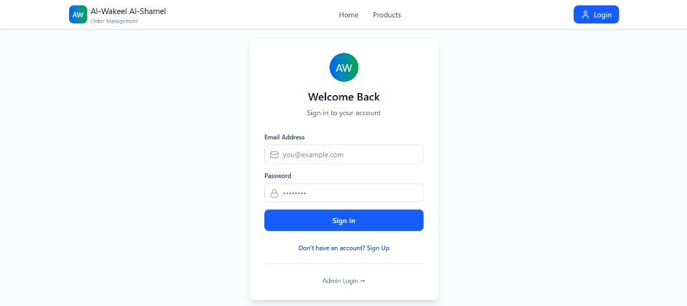

**Administrators** must use the separate admin login:
- From the main login page, click **Admin Login →**, or go directly to `/admin/login`.

### 3.4 Logging Out

Click **Logout** in the top-right corner. You will be returned to the login page.

### 3.5 Creating a New Customer Account

1. Click **Sign Up** on the home page or login page.
2. Fill in your full name, phone number, email address, delivery address, and password.
3. Click **Create Account**.
4. A **verification email** is sent to your inbox.
5. Open the email and click the verification link.
6. After verification, log in and start shopping.

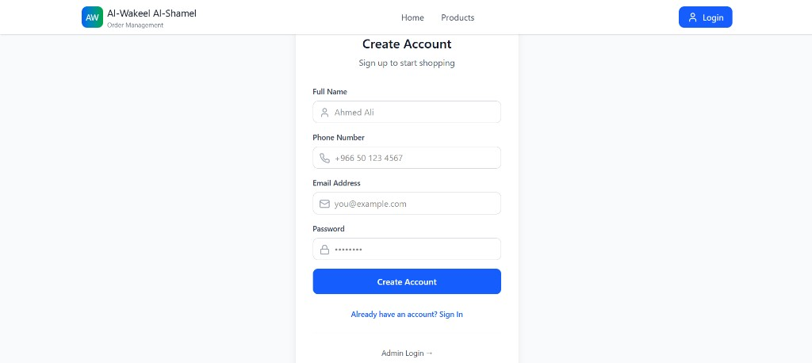

> **Important:** You must verify your email before you can use the cart or place orders.

If you do not receive the email:
- Check your spam/junk folder.
- Log in and go to **Profile** → click **Resend verification email**.

---

## 4. Customer Guide

### 4.1 Home Page

The home page introduces Al-Wakeel Al-Shamel and provides:
- A **Browse Products** button (requires login)
- A **Sign Up** button for new visitors
- A "Why Shop With Us?" section highlighting key benefits

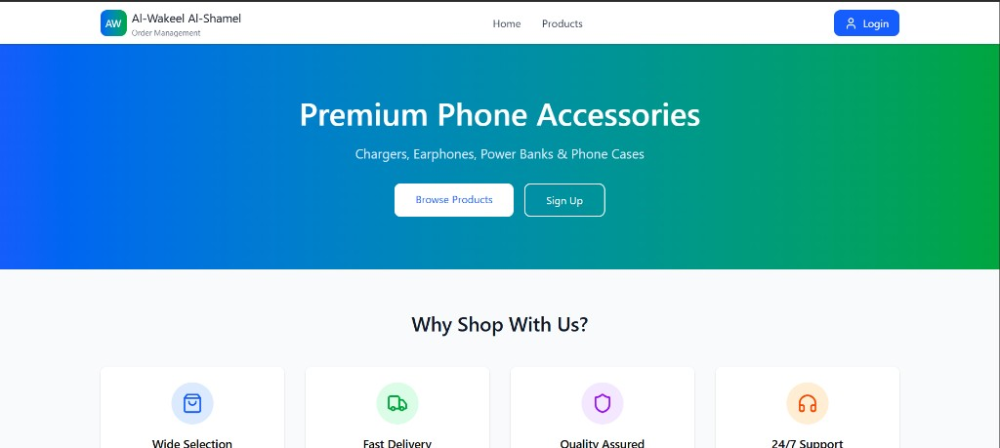

Scrolling down shows the **Popular Categories** section with visual links to Chargers, Earphones, Power Banks, and Phone Cases, and a call-to-action to create an account.

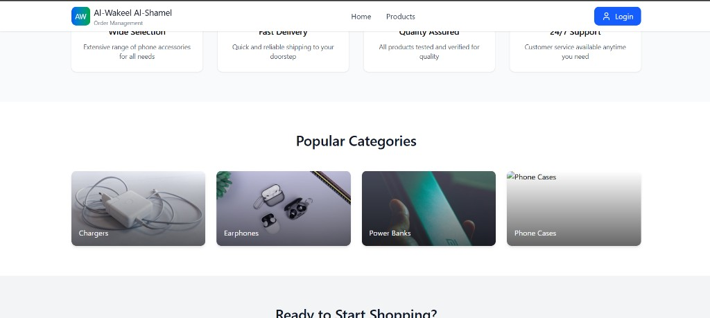

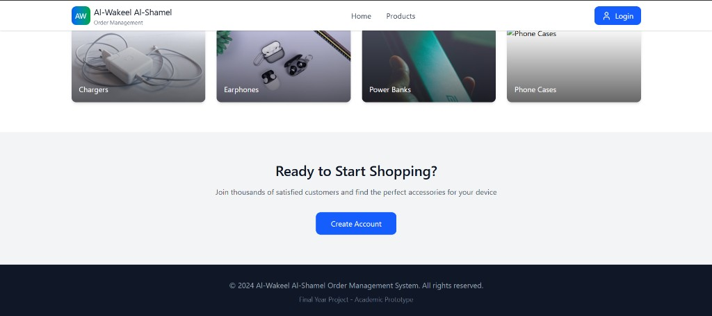

### 4.2 Browsing Products

1. After logging in, click **Products** in the navigation bar.
2. Use the **search bar** to find products by name.
3. Use the **category filter** dropdown (All, Chargers, Earphones, etc.) to narrow results.
4. Each product card shows the image, name, description, price, and stock level.

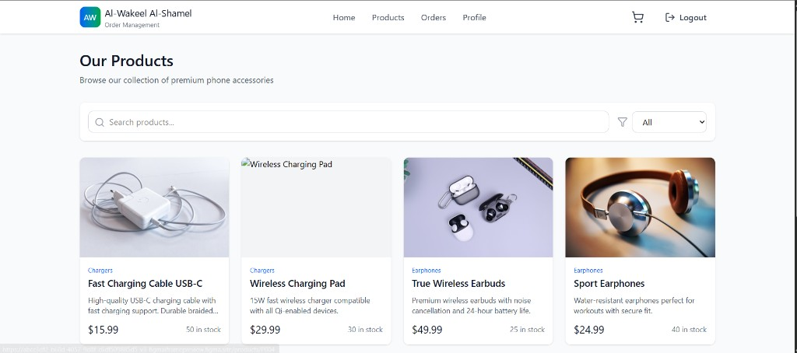

5. Click any product card to open the **Product Details** page.
6. On the details page, review the description, price, stock level, and product features.

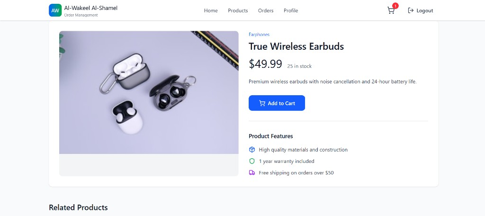

### 4.3 Adding Items to the Cart

- On the Products page, click **Add to cart** on any in-stock product card.
- Or open a product's detail page, set the quantity, and click **Add to Cart**.
- The **cart icon (🛒)** in the top bar shows a badge with the total number of items in your cart.

### 4.4 Managing the Shopping Cart

Click the cart icon to open the **Shopping Cart** page.

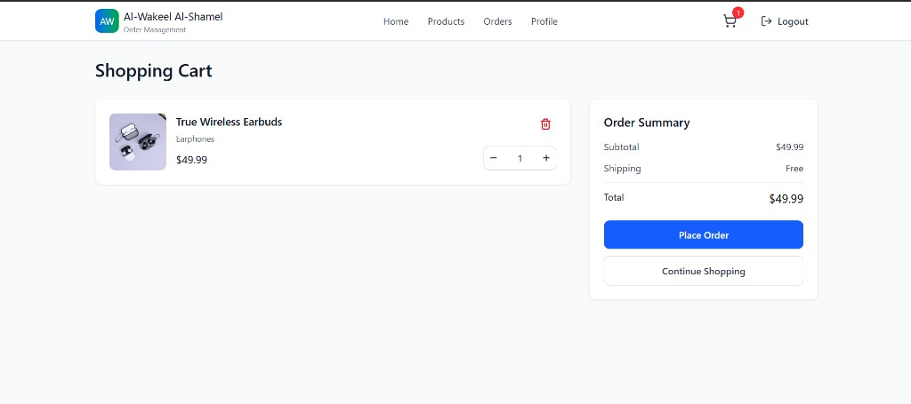

On the Shopping Cart page you can:

| Action | How |
|--------|-----|
| Change quantity | Use the **−** and **+** buttons next to an item |
| Remove an item | Click the **🗑** (trash) icon |
| Review totals | See subtotal, FedEx shipping (Free), and total |

**Shipping:** All orders ship via **FedEx Express** (estimated 3–5 business days). Shipping is free on all orders.

### 4.5 Checkout and Payment

From the Cart page, select a payment method and complete checkout. The process follows four steps shown at the top of the page:

```
Cart → Payment Verification → Order Confirmation → Invoice
```

#### Step 1 — Cart (Order Details)

1. Select a **Payment Method**:
   - **Credit Card** — pay online now
   - **Cash on Delivery** — pay when the order arrives

2. **If paying by Credit Card**, enter:
   - Cardholder name
   - Card number
   - Expiry date (MM/YY)
   - CVV

   > For testing, use card number `4111 1111 1111 1111` with any valid future expiry date and a 3-digit CVV.

3. Click **Proceed to Payment Verification**.

#### Step 2 — Payment Verification

- For card payments, a short verification screen simulates payment processing. Wait for the countdown or click **Proceed** when ready.
- For Cash on Delivery, this step confirms your order details before finalising.

#### Step 3 — Order Confirmation

- You see your **Order ID**, total amount, payment method, and FedEx tracking number.
- A confirmation email with a PDF invoice is sent to your registered email address.

#### Step 4 — Invoice

- View the full invoice on screen.
- Options: **Download PDF**, **Print**, or return to **Order History**.

### 4.6 Order History

1. Click **Orders** in the navigation bar.
2. View all past orders with order ID, date, status, items, prices, and FedEx tracking number.
3. Filter by status using the dropdown at the top (Placed, Processing, Shipped, Delivered, Cancelled).

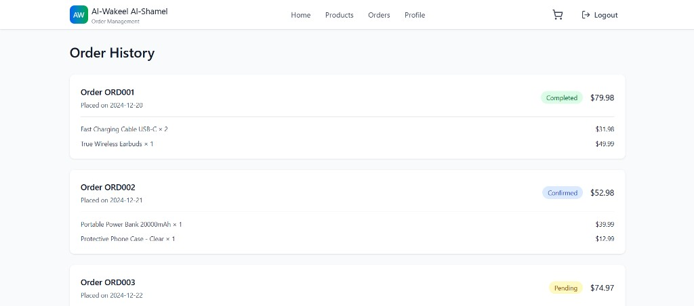

4. For each order you can:
   - **View invoice** — opens the invoice page
   - **Download PDF** — saves the invoice as a PDF file
   - **Reorder** — copies items back into your cart

### 4.7 My Profile

1. Click **Profile** in the navigation bar.
2. View your account details: name, email, phone, address, and member-since date.
3. The **Account Statistics** section shows total orders, total amount spent, completed orders, and pending orders.

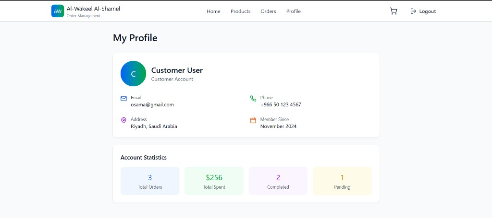

4. **Edit profile:** Update your name, phone, or address → click **Save Changes**.
5. **Change password:** Enter your current and new password → click **Update Password**.
6. **Email verification:** If your email is not yet verified, click **Resend verification email**.

---

## 5. Administrator Guide

Administrators use a separate **dark-themed Admin Panel** with its own navigation bar.

### 5.1 Accessing the Admin Panel

1. Go to https://alwakeel-alshamel.vercel.app/admin/login
2. Log in with an Admin account (e.g. `admin@demo.local` / `DemoPass!123`).
3. You are taken to the **Admin Dashboard**.

### 5.2 Admin Dashboard

The dashboard provides a real-time overview of the entire business.

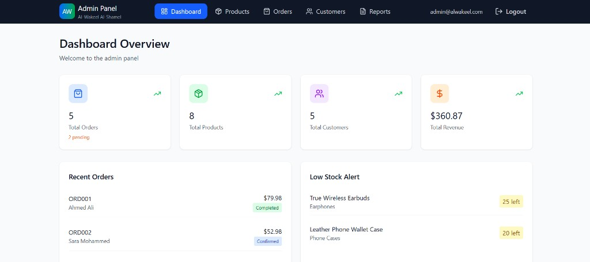

The dashboard displays:
- **Total Orders** — all orders in the system, with a pending count highlighted in amber
- **Total Products** — number of active products in the catalogue
- **Total Customers** — number of registered customer accounts
- **Total Revenue** — cumulative cash revenue across all orders
- **Recent Orders** — latest orders with customer name, status badge, and total
- **Low Stock Alert** — products at or near their minimum stock threshold

Click **Refresh** to reload the latest data from the server.

### 5.3 Product Management

**Navigation:** Admin Panel → **Products**

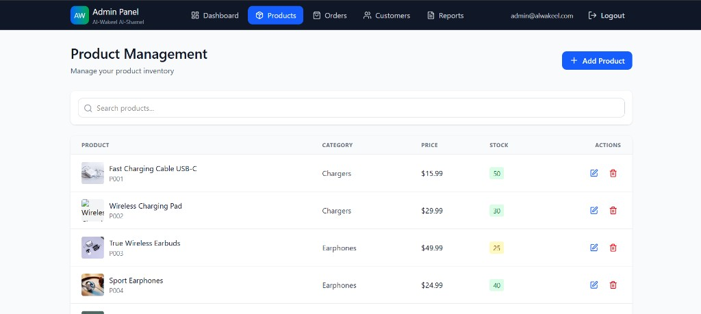

| Task | Steps |
|------|-------|
| **View all products** | Scroll the product table; use the search box to filter by name or ID |
| **Add a product** | Click **+ Add Product**, fill in the form (Product ID, Name, Category, Price, Stock Level, Description, Image URL), then click **Save product** |
| **Edit a product** | Click the **✎** (pencil) icon on a row — the form fills with the product's current data. Modify the fields, then click **Save product** |
| **Delete a product** | Click the **🗑** icon and confirm the deletion |

**Image URL tip:** Use paths like `/images/products/charger.jpg` for images stored in the website's public folder, or supply a full external URL.

### 5.4 Order Management

**Navigation:** Admin Panel → **Orders**

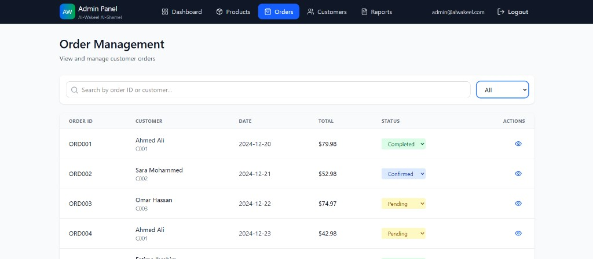

- View all customer orders in a searchable table.
- Columns: Order ID, Customer (name and ID), Date, Total, Payment Method, Shipping (FedEx tracking number and ETA).
- Use the **search box** to find orders by Order ID or customer email.
- Orders are **fulfilled automatically** via FedEx after checkout — no manual status changes are required.

### 5.5 Customer Management

**Navigation:** Admin Panel → **Customers**

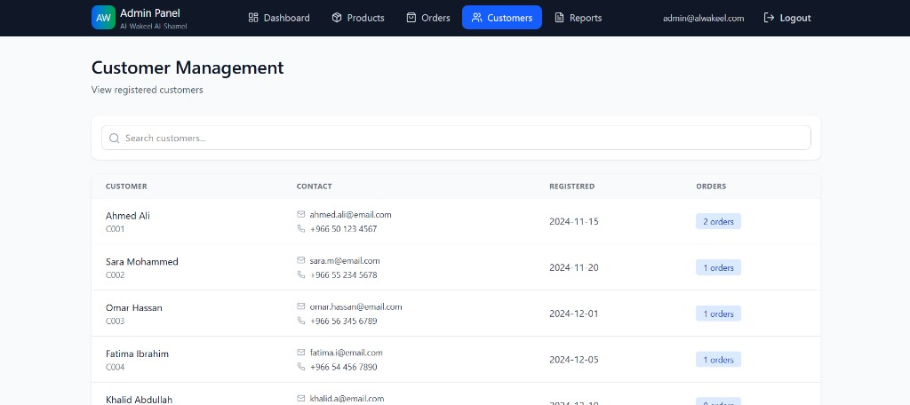

- View all registered customers with their name, customer ID, email, phone number, registration date, and order count.
- Use the **search box** to find a specific customer by name or email.

### 5.6 Sales Reports

**Navigation:** Admin Panel → **Reports**

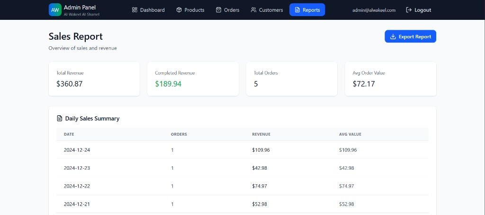

The top of the Reports page shows four key metrics:
- **Total Revenue** — gross revenue across all orders
- **Completed Revenue** — revenue from fully completed orders only
- **Total Orders** — total number of orders placed
- **Avg Order Value** — average spend per order

Scrolling down shows detailed breakdowns:

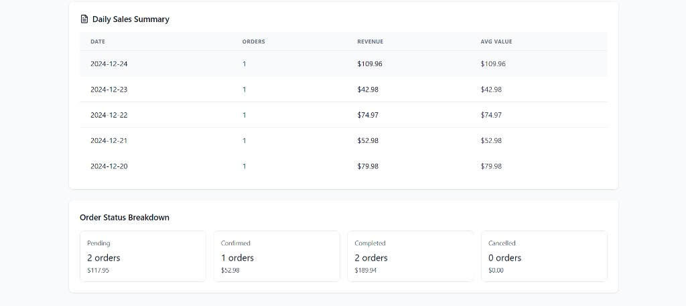

- **Daily Sales Summary** — orders and revenue per day, sorted by most recent date
- **Order Status Breakdown** — count and revenue split by Pending, Confirmed, Completed, and Cancelled

Click **Export Report** to download the report data for offline use.

---

## 6. Retail Salesperson Guide

### 6.1 Sales Dashboard

**Navigation:** After login → automatically redirected to the **Sales Dashboard**

The Sales Dashboard shows:
- Total orders, cash orders, and cash revenue metrics
- A table of recent customer orders (Order ID, customer email, status, total, and date)

### 6.2 Viewing Orders

**Navigation:** **Orders** in the top menu

- Read-only list of all customer orders.
- Displays payment method, FedEx shipping details, and order totals.
- Use this page to answer customer enquiries and monitor sales activity.

> Sales staff cannot modify orders or approve payments — all orders are processed automatically at checkout.

---

## 7. Warehouse Manager Guide

### 7.1 Warehouse Dashboard

**Navigation:** After login → **Dashboard**

The Warehouse Dashboard shows:
- **Low Stock** alerts — products at or below the stock threshold, sorted by quantity ascending
- **Recent Inventory Activity** — a timestamped log of stock received, check-ups performed, and quantity changes from customer orders

### 7.2 Inventory Management

**Navigation:** **Inventory** in the top menu

The Inventory page has two action panels at the top and a full inventory table below.

#### Receive Stock

1. Select a **product** from the dropdown list.
2. Enter the **quantity** received (minimum 1).
3. Add an optional **note** (e.g. "Supplier delivery #4521").
4. Click **Receive**.
5. The product's available quantity and stock level increase automatically.

#### Log Check-up

1. Select an **inventory location** from the dropdown list.
2. Add an optional **note** describing the check-up findings.
3. Click **Log check-up**.
4. The **Last Check-up** date for that inventory row is updated.

#### Inventory Table

| Column | Description |
|--------|-------------|
| Product | Name and Product ID |
| Location | Warehouse location code |
| Available | Units currently available for sale |
| Reserved | Units reserved for pending orders |
| Last Check-up | Date and time of the most recent check-up |

### 7.3 Viewing Products

Warehouse managers can open the **Products** page to view the full catalogue and current stock levels (read-only). Product editing is performed by Administrators only.

---

## 8. Troubleshooting

### 8.1 Common Issues

| Problem | Likely Cause | Solution |
|---------|--------------|----------|
| Page loads slowly on first visit | API server waking from sleep (Render free tier) | Wait 30–60 seconds and refresh |
| "Failed to load profile" or blank data | Stale login token | **Log out** and **log in** again |
| Cannot access Cart or Checkout | Email not verified | Click the link in your verification email, or resend it from Profile |
| Login fails for demo accounts | Typo in email or password | Use exact emails from Section 3.2 with password `DemoPass!123` |
| Credit card payment rejected | Invalid test card details | Use `4111 1111 1111 1111` with a future expiry date and any 3-digit CVV |
| No verification email received | Email may be in spam folder | Check spam/junk; contact the administrator if still missing |
| Products show zero stock | Inventory depleted | Warehouse Manager receives new stock, or Admin increases the stock level |
| Navigation links not visible on mobile | Menu is collapsed | Tap the **☰** icon in the top bar to expand the menu |

### 8.2 Clearing Browser Session

If you experience persistent errors after a system update:

1. Click **Logout**.
2. Clear your browser cache, or open the site in a private/incognito window.
3. Log in again.

### 8.3 Getting Help

For technical support, contact the system developer or your course instructor and include:
- Your role and the email address used to log in
- The page where the error occurred
- A screenshot of any error message displayed
- The approximate date and time of the issue

---

## 9. Appendix

### 9.1 Glossary

| Term | Definition |
|------|------------|
| **OMS** | Order Management System |
| **SKU / Product ID** | Unique code for each product (e.g. `P001`) |
| **COD** | Cash on Delivery — payment collected when the order arrives |
| **FedEx Express** | Courier service used for all shipments in this system |
| **JWT** | Secure token used to keep the user logged in between pages |
| **Invoice** | PDF document listing order items, totals, and payment details |

### 9.2 Pre-loaded Demo Products

| Product ID | Name | Category |
|------------|------|----------|
| P001 | Fast Charging Cable USB-C | Chargers |
| P002 | Wireless Charging Pad | Chargers |
| P003 | True Wireless Earbuds | Earphones |
| P004 | Sport Earphones | Earphones |

### 9.3 Checkout Flow Diagram

```
┌─────────┐    ┌──────────────────────┐    ┌─────────────────┐    ┌─────────┐
│  Cart   │ →  │ Payment Verification │ →  │  Confirmation   │ →  │ Invoice │
│         │    │  (card or COD)       │    │  + Email sent   │    │  (PDF)  │
└─────────┘    └──────────────────────┘    └─────────────────┘    └─────────┘
                        ↓
               FedEx order created
               Tracking number assigned
```

### 9.4 Document Revision History

| Version | Date | Changes |
|---------|------|---------|
| 1.0 | June 2026 | Initial user manual for production deployment |

---

*End of User Manual*
